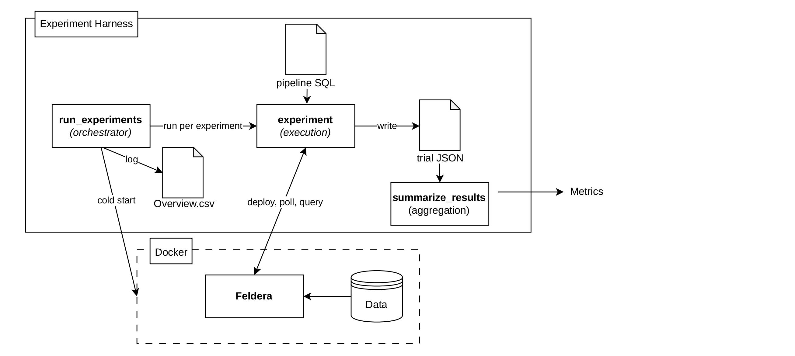

# Experiment Harness

_← Back to the [repository overview](../README.md)._

A benchmarking harness that deploys each query's pipelines on [Feldera](https://www.feldera.com/) — a flat baseline and its tree-decomposition rewrites — runs each over a dataset, and measures its **throughput** and **peak memory**, so the decompositions can be compared against the baseline. Built for a Bachelor's [thesis](../thesis), which develops and evaluates the approach.



---

## What it does

The harness runs a list of experiments, each pairing a **pipeline** (a Feldera SQL file for one query variant) with a **dataset**. It steps through them one at a time, and for each it

1. **cold-starts** a fresh Feldera in Docker, so nothing carries over from the previous run,
2. **deploys** the pipeline and lets Feldera ingest the dataset through its input connectors,
3. **measures** throughput and peak memory while the pipeline ingests and incrementally maintains the views,
4. **checks** the result count, which every variant of a query must agree on, and
5. writes the metrics to a per-trial JSON file.

A summary script reduces the trials of each pipeline to one row — average throughput and time, peak memory, and result count. Feldera runs in Docker, and the harness is Python.

---

## How it works

Feldera runs in a Docker container (`docker-compose.yaml`), and three Python scripts drive it.

### Orchestrator — `run_experiments.py`

Holds the list of experiments (the `EXPERIMENTS` list, each with a pipeline path, dataset path, trial count, and output directory) and runs them one at a time. Commenting entries in or out selects what runs. Before each experiment it does a **cold start** for isolation — `docker compose down -v`, wipe Feldera's storage directory, `docker compose up -d` — so no state or cache carries over. It then runs `experiment.py` under a 15-hour timeout and logs the outcome and duration to `OVERVIEW.csv`.

### Execution — `experiment.py`

Runs one pipeline on one dataset for the given number of trials. It reads the pipeline SQL, substitutes the `{{FILE_PATH}}` placeholder with the dataset path (so one pipeline file can serve several same-schema datasets), and deploys it through the Feldera Python SDK, which ingests the data through the input connectors. Each trial is multithreaded: a poller samples Feldera every 5 seconds (uptime, records processed, resident memory) while a second thread waits for ingestion to finish (3-hour timeout). Afterwards it queries the `RESULT` view's count as a correctness check, computes throughput (records ÷ uptime) and peak memory, writes `trial<N>.json`, and clears Feldera's storage between trials.

The orchestrator runs it as a subprocess with these values as command-line flags, so it can equally be run on its own:

```bash
python experiment.py --pipeline-sql-path <sql> --dataset-path <data> --trials <n> --output-dir <dir>
```

### Aggregation — `summarize_results.py`

Pointed at one results folder (set at the bottom of the script), it reads that folder's `trial<N>.json` files, groups them by pipeline, and prints a table of average throughput and time, peak memory, and result count over the trials, flagging any pipeline whose trials disagree.

---

## Reproduce the experiments

### Prerequisites

- Docker, with Docker Compose — the daemon must be running (start Docker Desktop on macOS or Windows — on Linux it is usually already running as a service)
- Python 3, then `pip install -r requirements.txt`

`run_experiments.py` starts Feldera itself: `docker compose` pulls Feldera's `pipeline-manager` image from its registry and runs it — nothing to install by hand. Its version is pinned in `docker-compose.yaml` to match the Feldera SDK in `requirements.txt`.

### 1. Adjust the hardcoded paths

The paths are set for the machine the experiments ran on, so change them to yours:

- **`docker-compose.yaml`** — the two host volumes: the dataset directory (mounted to `/data`) and Feldera's storage directory (mounted to `/home/ubuntu/.feldera`).
- **`run_experiments.py`** — the storage directory the cold start wipes, which must match the storage mount above. It is deleted through a throwaway root container (Docker creates it as root), so update its host base path there too.
- The **`EXPERIMENTS`** entries — each `dataset-path` and `output-dir`.

### 2. Prepare the datasets

See [Datasets](#datasets), and place them under the host directory mounted to `/data`.

### 3. Select and run

Comment out the `EXPERIMENTS` entries you do not want, then:

```bash
python run_experiments.py
```

It manages Docker itself — cold-starting a fresh Feldera before each experiment — runs each under a 15-hour timeout, and logs progress to `OVERVIEW.csv`.

### 4. Read the results

Each trial is written as `trial<N>.json` under its output directory. Point `summarize_results.py` at a results folder (edit the path at the bottom of the script) and run it:

```bash
python summarize_results.py
```

---

## Datasets

Place each dataset under the host directory mounted to `/data`, matching the `dataset-path` used in the matrix.

**TPC-H** — generated with the helper (via DuckDB), once per scale factor:

```bash
python helper/generate_tpch_data.py --sf 1 --output-dir <dir>
```

**SNAP graphs** — `soc-Epinions1`, `cit-HepTh`, `p2p-Gnutella31`, downloaded from [snap.stanford.edu/data](https://snap.stanford.edu/data). Each download is a tab-separated edge list (`x.txt`) with `#` comment lines. The connectors expect a headed CSV, so convert it:

```bash
echo "FromNodeId,ToNodeId" > x.csv
grep -v '^#' x.txt | awk '{print $1","$2}' >> x.csv
```

The first line writes the header, the second drops the `#` comments and turns the two tab-separated columns into `from,to` rows.

**IMDB** — from the Join Order Benchmark of *[How Good Are Query Optimizers, Really?](https://www.vldb.org/pvldb/vol9/p204-leis.pdf)*. These CSVs have no header (the connectors are set accordingly), and the schema is given column prefixes so that `SELECT *` and the joins are easier to write.

---

## Pipelines

Each query has a folder under `pipelines/`, holding its variants as self-contained Feldera SQL files: a comment naming the dataset, the `CREATE TABLE` definitions with their connectors, and then the query's views (named in a comment above them). The file name encodes the variant — `baseline` is the flat query, `decomposition` and `decomposition_no_projection` are IVM⁺ and its variant, with `_full` (full-result reconstruction) and `_faq` (aggregate) forms. See the [thesis](../thesis) for the variants and the theory behind them.

---

## Project layout

| File / dir             | Role                                                           |
| ---------------------- | -------------------------------------------------------------- |
| `run_experiments.py`   | orchestrator — experiment matrix and per-experiment cold start |
| `experiment.py`        | execution — deploys a pipeline, runs trials, measures          |
| `summarize_results.py` | reduces the trial JSONs to a summary table                     |
| `docker-compose.yaml`  | Feldera (`pipeline-manager`) in Docker                         |
| `pipelines/`           | the query pipelines (baseline and decomposition variants)      |
| `helper/`              | dataset generation (TPC-H via DuckDB)                          |
| `requirements.txt`     | Python dependencies                                            |

---

## License

Licensed under the MIT License — see [LICENSE](../LICENSE).

---

Part of a Bachelor's thesis at the University of Zurich ([DaST group](https://www.ifi.uzh.ch/dast)). See the [repository overview](../README.md) for the rest of the project, including the [query decomposer](../query-decomposer#readme).
