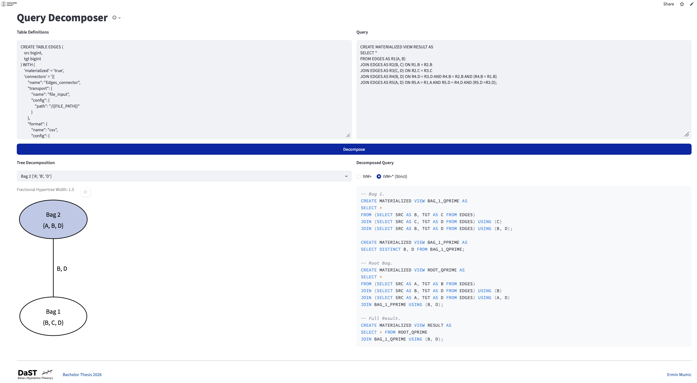
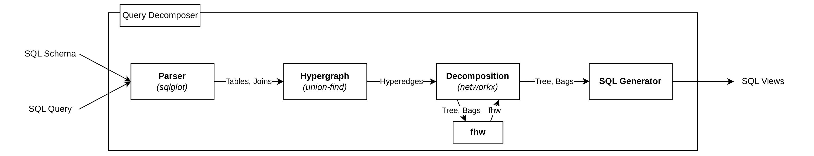

# Query Decomposer

_← Back to the [repository overview](../README.md)._

Turn a **full conjunctive query** into an incrementally maintainable pipeline of SQL views for an incremental engine such as [Feldera](https://www.feldera.com/), derived from a **tree decomposition** of the query. Built for a Bachelor's [thesis](../thesis), which develops and evaluates the approach.

**Live demo:** [query-decomposer.streamlit.app](https://query-decomposer.streamlit.app)



---

## What it does

Given a set of `CREATE TABLE` definitions and a single join query, the tool

1. parses the query and builds its **hypergraph**,
2. computes a **tree decomposition** of that hypergraph and its **fractional hypertree width (FHW)**,
3. generates the corresponding **SQL views** — a `Q'` view per bag, a `P'` view for each non-root bag, and a final `RESULT` view — which an incremental engine keeps up to date as the input changes, and
4. renders the decomposition tree, with a selectable root and a toggle between the two variants.

**Example** — the "diamond" self-join used as the running example in the [thesis](../thesis), five occurrences of an edge relation:

```sql
-- Table definitions
CREATE TABLE EDGES (
    src bigint,
    tgt bigint
);

-- Query
SELECT *
FROM EDGES AS R1(A, B)
JOIN EDGES AS R2(B, C) ON R1.B = R2.B
JOIN EDGES AS R3(C, D) ON R2.C = R3.C
JOIN EDGES AS R4(B, D) ON R4.D = R3.D AND R4.B = R2.B AND (R4.B = R1.B)
JOIN EDGES AS R5(A, D) ON R5.A = R1.A AND R5.D = R4.D AND (R5.D = R3.D);
```

With the root at bag `{A, B, D}` (its child `{B, C, D}` is numbered `BAG_1`), the **IVM⁺** views it generates are:

```sql
-- Bag 1.
CREATE MATERIALIZED VIEW BAG_1_QPRIME AS
SELECT *
FROM (SELECT SRC AS B, TGT AS C FROM EDGES)
JOIN (SELECT SRC AS C, TGT AS D FROM EDGES) USING (C)
JOIN (SELECT SRC AS B, TGT AS D FROM EDGES) USING (B, D)
JOIN (SELECT DISTINCT TGT AS B FROM EDGES) USING (B)
JOIN (SELECT DISTINCT TGT AS D FROM EDGES) USING (D);

CREATE MATERIALIZED VIEW BAG_1_PPRIME AS
SELECT DISTINCT B, D FROM BAG_1_QPRIME;

-- Root Bag.
CREATE MATERIALIZED VIEW ROOT_QPRIME AS
SELECT *
FROM (SELECT SRC AS A, TGT AS B FROM EDGES)
JOIN (SELECT SRC AS B, TGT AS D FROM EDGES) USING (B)
JOIN (SELECT SRC AS A, TGT AS D FROM EDGES) USING (A, D)
JOIN (SELECT DISTINCT SRC AS B FROM EDGES) USING (B)
JOIN (SELECT DISTINCT TGT AS D FROM EDGES) USING (D)
JOIN BAG_1_PPRIME USING (B, D);

-- Full Result.
CREATE MATERIALIZED VIEW RESULT AS
SELECT * FROM ROOT_QPRIME
JOIN BAG_1_QPRIME USING (B, D);
```

The strict variant (`IVM⁺*`) is identical except that each `Q'` view drops the two `SELECT DISTINCT` semijoins.

---

## How it works



`main.py` drives the four stages through two functions: `run_pipeline()` runs stages 1–3 (parse → hypergraph → decomposition, including the FHW), and `generate()` runs stage 4, emitting the SQL views for a chosen root and variant.

### 1. Parser — `parser.py`

Uses [`sqlglot`](https://github.com/tobymao/sqlglot) to parse the schema and query into an abstract syntax tree. Walking it clause by clause, it collects the relations (resolving table and column aliases, and treating each occurrence of a self-joined relation as an independent relation), the equi-join conditions (`JOIN … ON` and `JOIN … USING`), and the single-relation `WHERE` filters, and detects whether the query is `SELECT *` or `SELECT COUNT(*)`. The full schema is needed because the tool returns _all_ variables, so it must know every column of every relation, even those the query never mentions.

### 2. Hypergraph — `hypergraph.py`

Columns equated by a join are merged into a single **variable** with a **union-find** structure, so an equi-join between differently named columns still yields one hypergraph vertex. Each relation becomes a **hyperedge** over its variables. The stage also records, in both directions, which column of each relation a variable stands for — the mapping the generator needs later.

### 3. Decomposition — `decomposition.py`, `fhw.py`

Computing a minimum-FHW decomposition is NP-hard, so the tool uses the **Minimum Fill-in** heuristic from [`networkx`](https://networkx.org/), which runs on the query's **primal graph** (each hyperedge turned into a clique). Minimum Fill-in optimises _treewidth_, but IVM⁺ cost is governed by _FHW_, and two decompositions of equal treewidth can differ in FHW. The tool therefore runs the heuristic on several vertex-insertion orderings — a sorted baseline plus a fixed set of seeded shuffles, so results are deterministic — whose different tie-breaks yield different decompositions, computes each one's FHW, and keeps the smallest. FHW is the maximum over the bags of the **fractional edge cover number**, each solved as a small linear program with `scipy.optimize.linprog` (`fhw.py`). Redundant bags (contained in a neighbour) are removed.

### 4. SQL generator — `sql_generator.py`

The tree is oriented from a chosen **root**, arranging the bags into a rooted tree, and each non-root bag's **bridge variables** (those it shares with its parent) are computed. Bottom-up, each bag gets a `Q'` view — its atoms as subqueries (each relation's physical columns aliased to the bag's variables, single-relation filters appended as `WHERE`), joined with `JOIN … USING`, then joined with the children's `P'` views on the bridge variables — and a `P'` view projecting onto the bridge variables. A final `RESULT` view reconstructs the full join (`SELECT *`) or returns the count (`SELECT COUNT(*)`, via the counting semiring). The two variants differ only in the `Q'` view: **IVM⁺** adds partially overlapping atoms as `SELECT DISTINCT` semijoins, while **IVM⁺\* (strict)** drops them.

The **frontend** (`frontend.py`) is a [Streamlit](https://streamlit.io) app wrapping this pipeline: the schema and query inputs, the generated views, the FHW, and an interactive tree with a selectable root and an IVM⁺/strict variant (`IVM⁺*`) toggle. It calls `run_pipeline()` once when you press _Decompose_, then `generate()` for the current root and variant. Changing the root or the variant re-runs only `generate()` on the stored decomposition, so the same decomposition is reused instead of running through all stages again.

---

## Supported

- `SELECT *` (full conjunctive query) and `SELECT COUNT(*)`
- Equi-joins written as `JOIN … USING (col)` or `JOIN … ON left.col = right.col`, over any number of relations
- Table and column aliases, and **self-joins**, including column-rename aliases (`EDGES AS R1(A, B)`)
- Single-relation `WHERE` filters (e.g. `R1.A > 100`), combined with `AND`
- Both variants: **IVM⁺** (semijoin projection) and **IVM⁺\*** (strict)
- Feldera table annotations (`WITH (...)`, connectors, `'materialized'`) are accepted and ignored, so a pipeline schema can be pasted in unchanged
- A `CREATE [MATERIALIZED] VIEW ... AS` wrapper around the query is accepted and ignored, so a Feldera view definition can be pasted in directly

## Limitations

- `COUNT(*)` is the only aggregate; `MIN` / `MAX` / `SUM` / `COUNT(col)` and column projections are not supported
- Only equi-joins; inequality and outer joins are not
- Each `WHERE` condition must reference a single relation (no cross-relation comparisons or disjunctions)
- No subqueries
- Assumes **set-valued** input relations, as IVM⁺ does. Under SQL's bag semantics, duplicate input rows can make the result over-count when a duplicated atom lies in more than one bag, since it is then counted in each

The decomposer performs only the checks its translation needs and is not a full SQL validator, so validate a query in a database engine (for instance Feldera) before handing it in.

---

## Run locally

```bash
cd query-decomposer
pip install -r requirements.txt
streamlit run frontend.py
```

The app opens in your browser and needs only the Python packages above — the tree is drawn in the browser, so you do not need to install Graphviz separately.

To run the pipeline without the UI:

```bash
python main.py    # prints the generated views for a built-in example
```

---

## Project layout

| File               | Role                                                                        |
| ------------------ | --------------------------------------------------------------------------- |
| `frontend.py`      | Streamlit UI                                                                |
| `main.py`          | orchestrates the pipeline (`run_pipeline`, `generate`)                      |
| `parser.py`        | SQL parsing (schema, joins, predicates, aggregation type)                   |
| `hypergraph.py`    | builds the query hypergraph (variables via union-find, hyperedges)          |
| `decomposition.py` | tree decomposition (Minimum Fill-in + FHW-selection over sampled orderings) |
| `fhw.py`           | fractional hypertree width via per-bag linear program                       |
| `sql_generator.py` | emits the `Q'` / `P'` views and the `RESULT` view                           |
| `requirements.txt` | Python dependencies                                                         |

---

## License

Licensed under the MIT License — see [LICENSE](../LICENSE).

---

Part of a Bachelor's thesis at the University of Zurich ([DaST group](https://www.ifi.uzh.ch/dast)). See the [repository overview](../README.md) for the rest of the project, including the [experiment harness](../experiment-harness).
